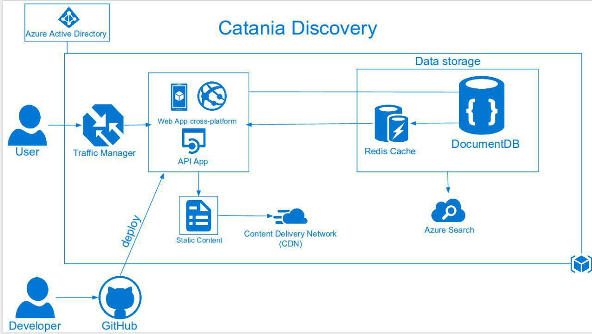

# Catania Discovery
University for **"Technologies and Advanced Programming"** course.

Architecture of the project.




### Requirements

- NodeJS & npm
- MongoDB

### Install Requirements on Ubuntu 16.04

Install **NodeJS** and **npm**
```
$ curl -sL https://deb.nodesource.com/setup_6.x -o nodesource_setup.sh
$ ./nodesource_setup.sh
$ sudo apt install nodejs
$ npm install
```

Install **MongoDB**
```
$ sudo apt install mongodb-server
```

### Configure

Copy the file *config.js.dist* into **config.js** and configure it like:

```
module.exports = {
    'secret': 'your_secret_string',
    'database': "mongodb://localhost:27017/db_name"
};
```

Run your application:
```
$ node server.js
```

Now you can visit http://localhost:8080/ and see the output of the project!
